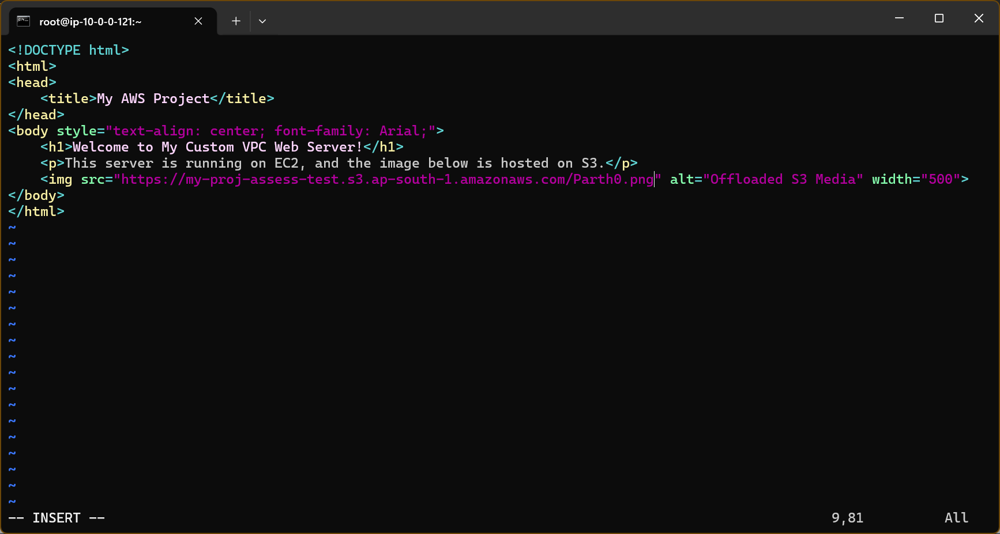
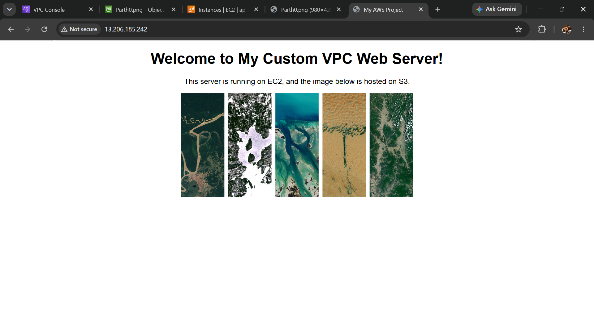
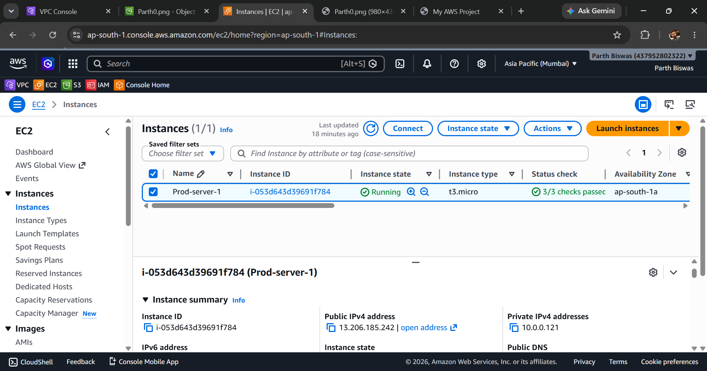
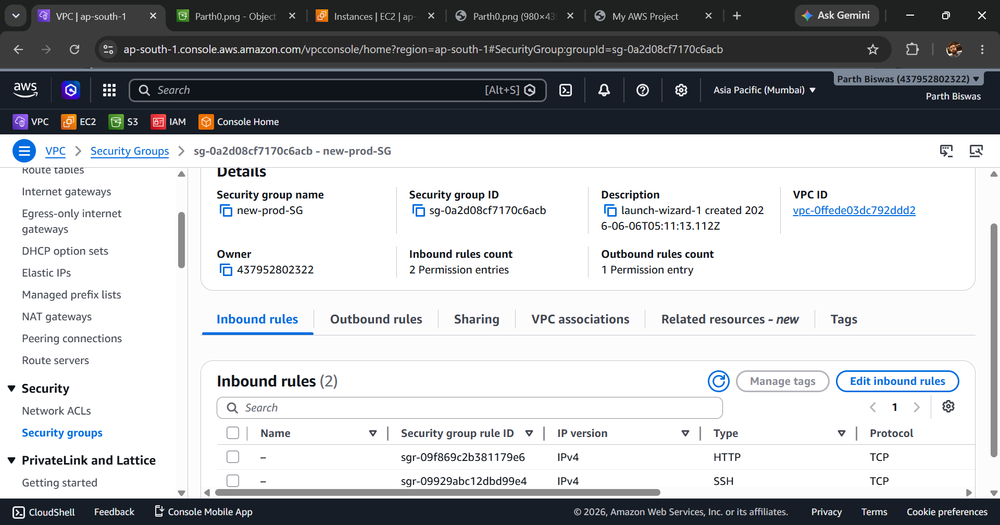
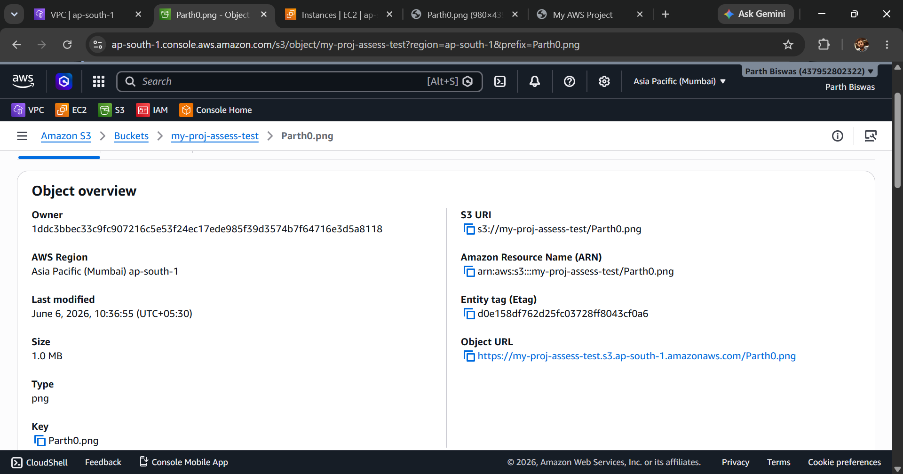
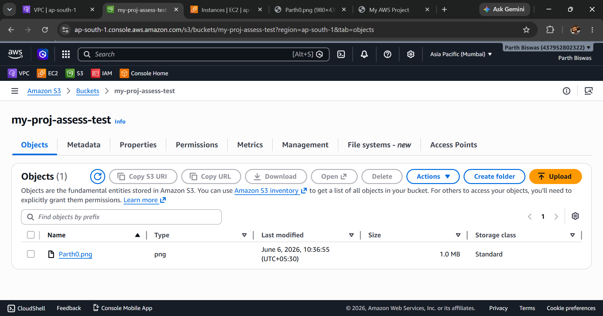
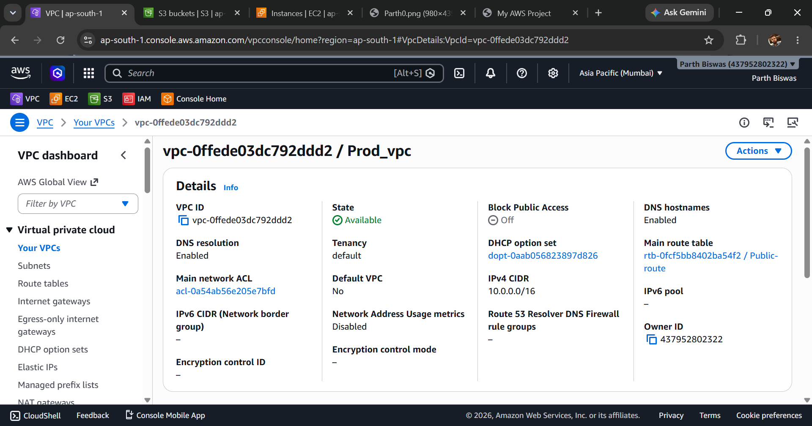
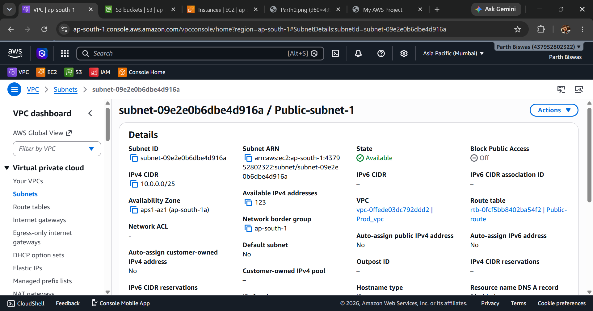
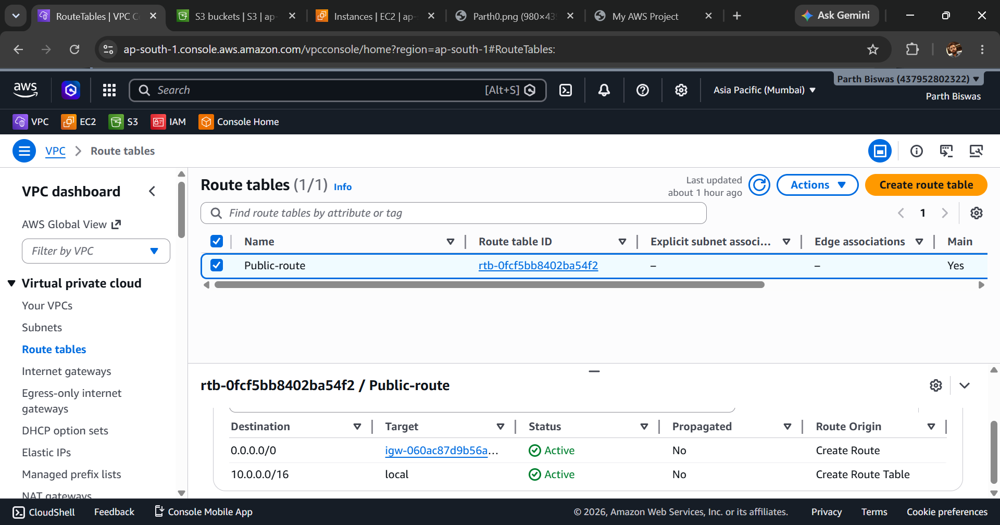
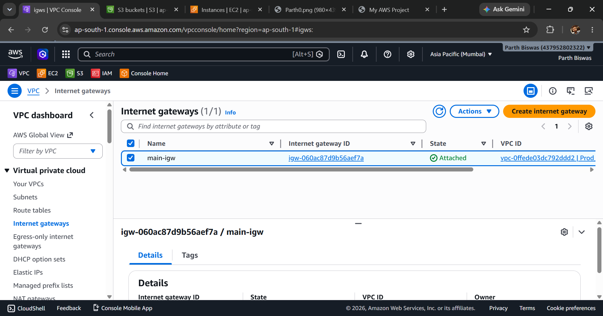

# AWS Custom VPC Web Server with S3 Asset Offloading

## 📝 Project Description

### Overview
This project is a hands-on implementation of core AWS networking, compute, and storage services. It demonstrates the ability to architect from scratch rather than relying on default AWS configurations. The core of this deployment is a custom Amazon Virtual Private Cloud (VPC) built to securely host a Linux-based EC2 web server, while utilizing Amazon S3 to offload static media assets. 

### The Architecture Strategy
In a standard, monolithic web deployment, a single server handles both compute requests (rendering HTML/backend logic) and the delivery of heavy static files (images, videos, CSS). This approach consumes valuable server bandwidth and compute resources. 

This project solves that by decoupling the workload:
1. **Compute Layer (EC2):** A lightweight `t3.micro` instance is dedicated solely to serving the core HTML structure. 
2. **Storage Layer (S3):** All static image assets are hosted in a dedicated S3 bucket (`my-proj-assess-test`) and served directly to the client's browser.

By decoupling the static media from the compute instance, this architecture reduces the load on the EC2 server, lowers bandwidth costs, and showcases foundational cloud optimization techniques.

### Key Features & Technologies
* **Amazon VPC:** Designed a custom `10.0.0.0/16` network footprint.
* **Subnetting & Routing:** Configured a Public Subnet (`10.0.0.0/25`) in the `ap-south-1a` Availability Zone, mapping an Internet Gateway (IGW) via a custom route table to enable internet access.
* **Security Groups:** Implemented the principle of least privilege. The `new-prod-SG` firewall strictly allows inbound traffic only on Port 80 (HTTP for web traffic) and Port 22 (SSH for server administration).
* **Amazon EC2:** Provisioned and configured a Linux virtual machine to act as the primary web server.
* **Amazon S3:** Configured object-level and bucket-level permissions to securely host and publicly serve static assets.

---


## 📸 Implementation Screenshots

### 1. Web Application & Code
**HTML Configuration on EC2:**


**Live Webpage Output:**


### 2. Compute & Security
**EC2 Instance (Prod-server-1):**


**Security Group (new-prod-SG):**


### 3. Storage (Amazon S3)
**S3 Bucket & Object Offloading:**



### 4. Networking (VPC, Subnets, Routing)
**Custom VPC (Prod_vpc):**


**Public Subnet:**


**Route Table & Internet Gateway:**



```

# 👨‍💻 Author: Parth Biswas
    GitHub: [@ParthBiswas](https://github.com/ParthBiswas)
    <br>
    LinkedIn: [ParthBiswas](https://linkedin.com/in/parthubiswas)
    <br>
    Email: Parthurmibiswas@gmail.com

```
---
*If you found this lab helpful, feel free to leave a ⭐ on the repository!*
